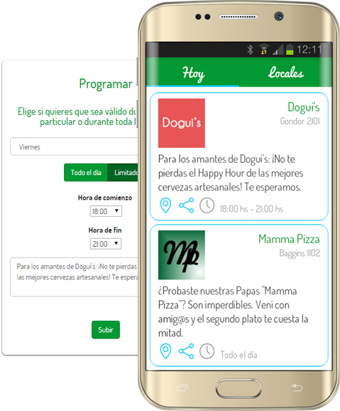

# Promm Android App (_Legacy_)

Development of [Promm](https://prommapp.com) Android app, which was once uploaded to Google Play and, most important, a young start-up.

## Resources

For more information, please visit [prommapp.com](https://prommapp.com) or my [article](https://medium.com/@perezzini/promm-reimagining-the-way-restaurants-connect-with-gastronomy-lovers-5d8ea67c71b) at Medium.

## Overview

